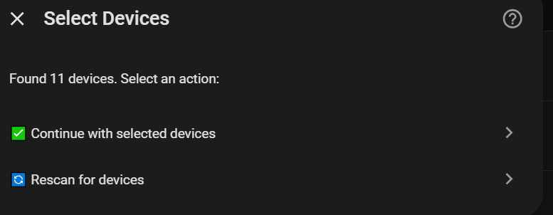
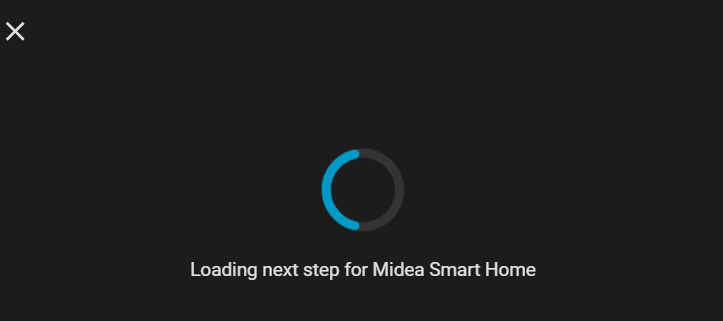
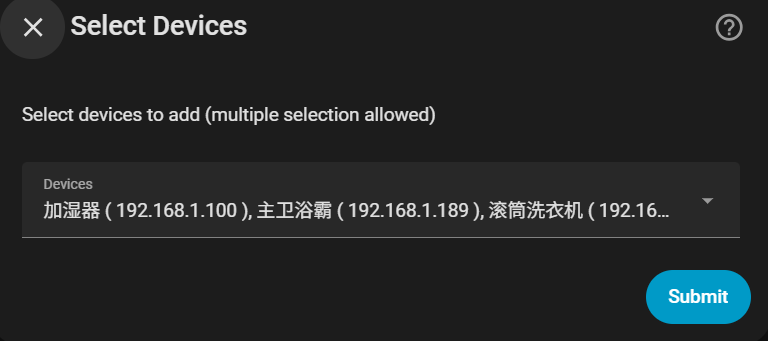
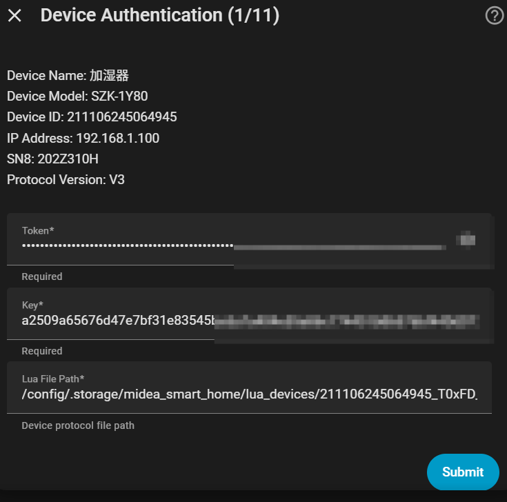
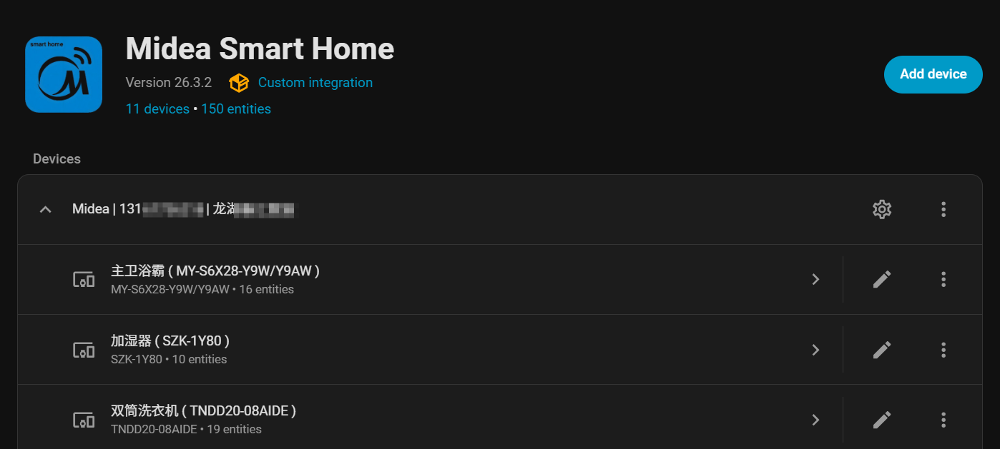
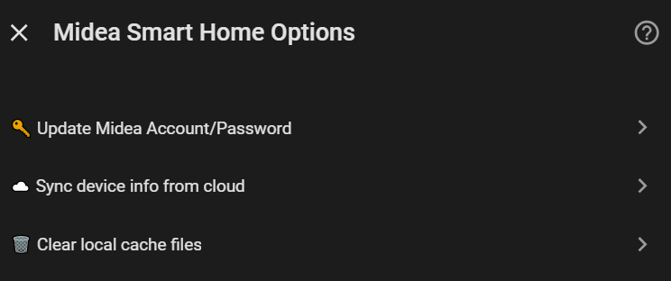
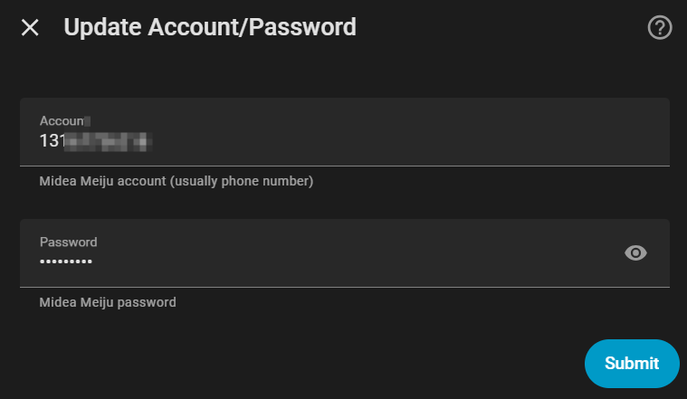
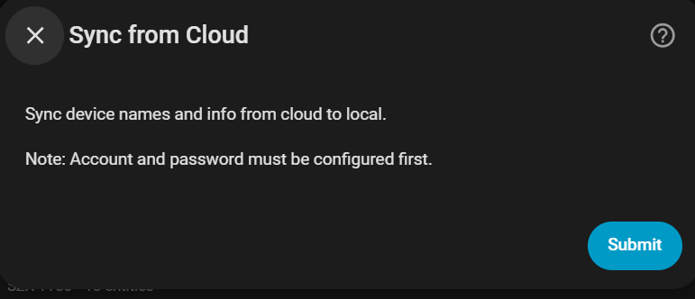
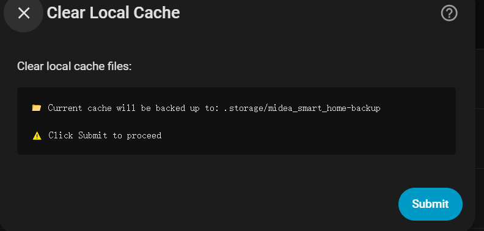

# Midea Smart Home Configuration Guide

[简体中文](GUIDE_hans.md) | English

This guide will help you configure the Midea Smart Home integration.

## Table of Contents

- [Prerequisites](#prerequisites)
- [Installation](#installation)
- [Configuration Flow](#configuration-flow)
  - [Step 1: Enter Account Credentials](#step-1-enter-account-credentials)
  - [Step 2: Select Devices](#step-2-select-devices)
  - [Step 3: Device Authentication](#step-3-device-authentication)
  - [Step 4: Configuration Complete](#step-4-configuration-complete)
- [Options](#options)
  - [Update Account Credentials](#update-account-credentials)
  - [Sync Device Info from Cloud](#sync-device-info-from-cloud)
  - [Clear Local Cache](#clear-local-cache)
- [FAQ](#faq)

---

## Prerequisites

1. **Midea Meiju Account**: A registered Midea Meiju account (phone number)
2. **Devices Bound**: Devices must be bound in the Midea Meiju App first
3. **Network**: Home Assistant and devices should be on the same LAN

## Installation

### HACS Installation (Recommended)

1. Open HACS
2. Search for "Midea Smart Home"
3. Click Download and restart Home Assistant

### Manual Installation

1. Copy `custom_components/midea_smart_home` to your Home Assistant `custom_components` directory
2. Restart Home Assistant

---

## Configuration Flow

### Step 1: Enter Account Credentials

1. Go to **Settings** → **Devices & Services** → **Add Integration**
2. Search for "Midea Smart Home" and select it
3. Enter your Midea Meiju account and password


#### Scan Address Options

| Input | Description |
|-------|-------------|
| `auto` | Auto-detect network interfaces and scan (recommended) |
| Router IP (e.g., `192.168.1.1`) | Scan the entire subnet |
| Device IP (e.g., `192.168.1.100`) | Scan only the specified device |

---

### Step 2: Select Devices

The system will automatically scan for Midea devices on your LAN. After scanning, the device selection screen will appear.



#### Options

| Option | Function |
|--------|----------|
| ✅ Continue with selected devices | Proceed to select devices to add |
| 🔄 Rescan for devices | Rescan the network for more devices |

#### Rescan

If not all devices were found on the first scan, click "Rescan":



**Note**: Rescanning only searches the LAN again, it does not re-authenticate with the cloud.

#### Select Devices to Add

After clicking "Continue with selected devices", a device list will appear with all devices pre-selected:



You can deselect devices you don't want to add, then click Submit.

---

### Step 3: Device Authentication

The system will automatically obtain Token and Key for each device for local communication.



**Note**: This process requires connecting to the cloud API, please ensure network connectivity.

---

### Step 4: Configuration Complete

After successful authentication, the integration configuration is complete. You will see the integration entry:



Entry title format: `Midea | {account} | {home_name}`

---

## Options

Click the "Configure" button in the top right corner of the integration entry to access these options:



### Update Account Credentials



Update your Midea Meiju account credentials. Use this if you've changed your password.

### Sync Device Info from Cloud



Sync device names, models, and other info from the cloud. The integration will automatically reload after syncing.

**Use Cases**:
- Changed device names in the Midea Meiju App
- Need to update device model information

### Clear Local Cache



Clear locally cached Lua scripts and JSON files. Current cache will be backed up to `.storage/midea_smart_home-backup`.

**Use Cases**:
- Device protocol updated and needs re-downloading
- Protocol parsing issues
- Completely remove integration entry and reconfigure (recommended to clear cache)

---

## FAQ

### Q: Cannot find any devices?

**Solutions**:
1. Make sure devices are powered on
2. Confirm devices are bound in the Midea Meiju App
3. Ensure Home Assistant and devices are on the same LAN (same subnet)
4. Try entering your router IP (e.g., `192.168.1.1`) to scan the entire subnet or specify device IP (e.g., `192.168.1.100`)
5. If using Docker, ensure network mode is `host` or port forwarding is configured correctly
6. Some devices may need firmware updates via the Midea Meiju App first

### Q: Device authentication failed?

**Solutions**:
1. Check if account credentials are correct
2. Confirm devices are bound to the current account
3. Try re-logging into the Midea Meiju App and retry
4. If using Midea Meiju overseas account, you may need to use the overseas version of the App

### Q: Device shows but cannot be controlled?

**Solutions**:
1. Check if the device is online (via Midea Meiju App)
2. Try reloading the integration
3. If it's a new device type, it may not be supported yet. Please submit an Issue

### Q: Device names not updated?

**Solutions**:
1. Go to integration options
2. Click "Sync device info from cloud"
3. Wait for sync to complete, devices will auto-reload

### Q: What device types are supported?

Please see [Supported Devices](README.md#supported-devices)

---

## Debug Logging

To troubleshoot issues, you can enable debug logging for detailed information.

### How to Enable

Add the following to your `configuration.yaml`:

```yaml
logger:
  default: warning
  logs:
    custom_components.midea_smart_home: debug
    midealocal: debug
```

Save and restart Home Assistant or call the `logger.set_level` service.

### Viewing Logs

1. **Via Web UI**: Settings → System → Logs
2. **Via File**: `home-assistant.log` file in your Home Assistant config directory

### When Submitting an Issue

Please attach relevant logs and remove sensitive information (such as Token, Key, account, etc.).

---

## Support

If you encounter any issues, please visit [GitHub Issues](https://github.com/Cyborg2017/midea_smart_home/issues).
