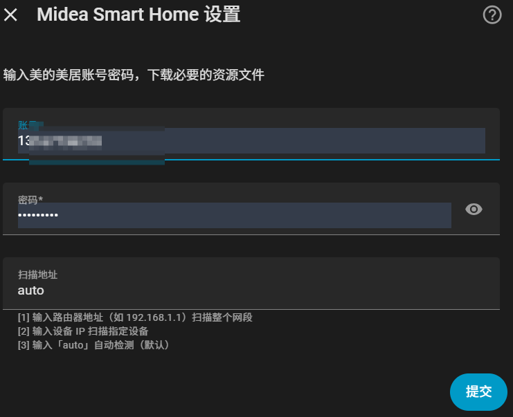
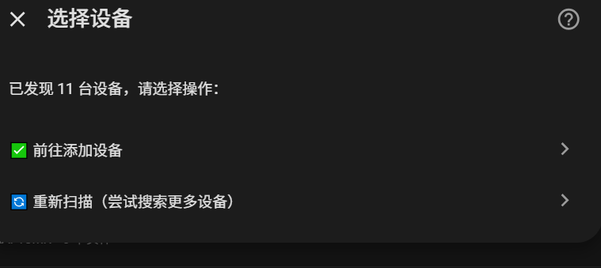
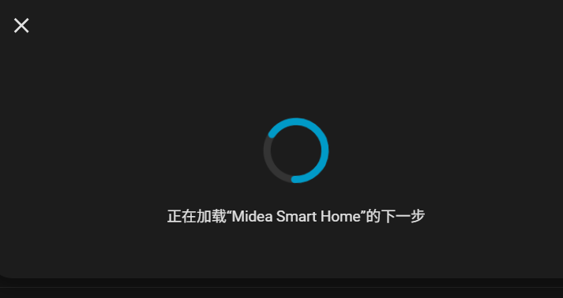
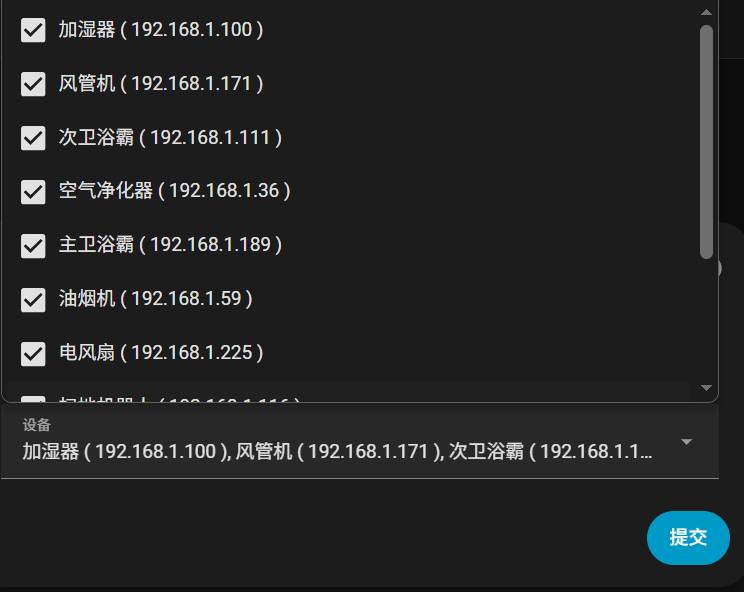
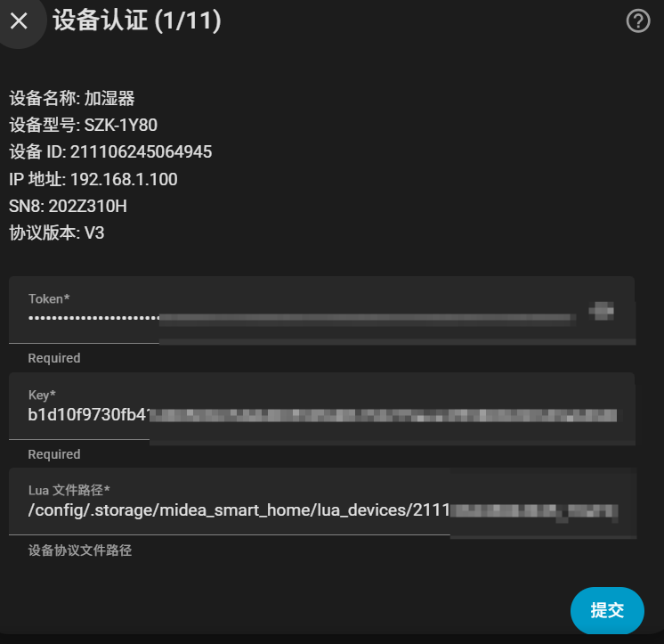
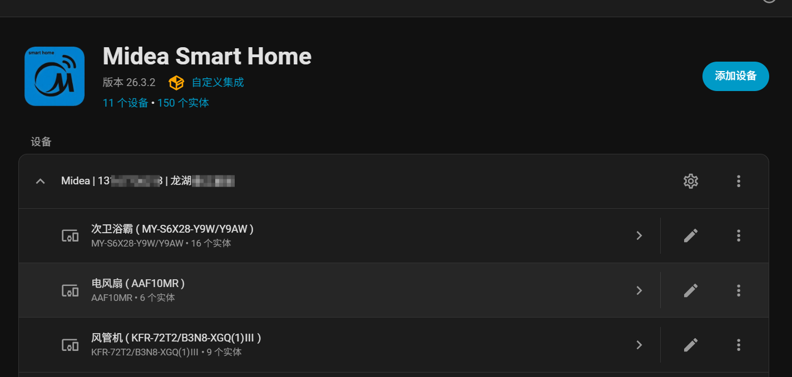
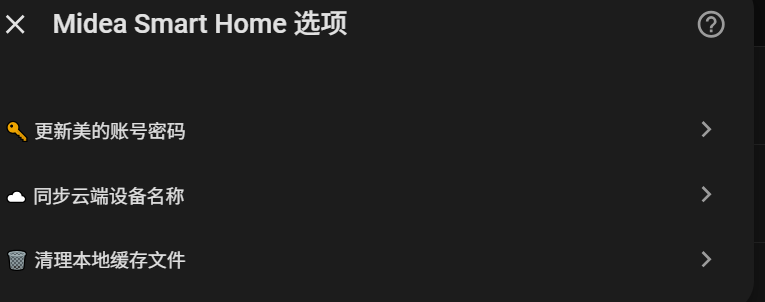
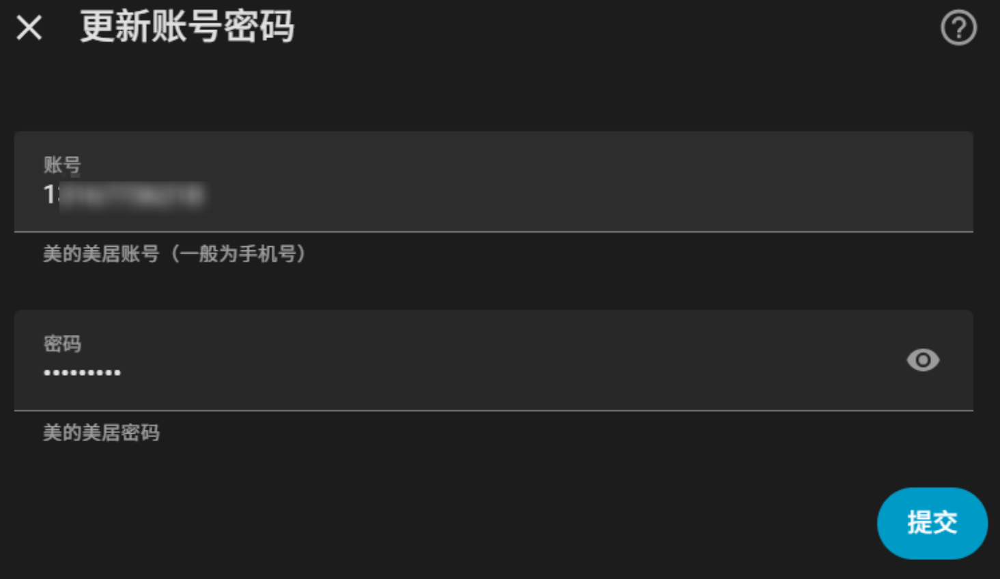
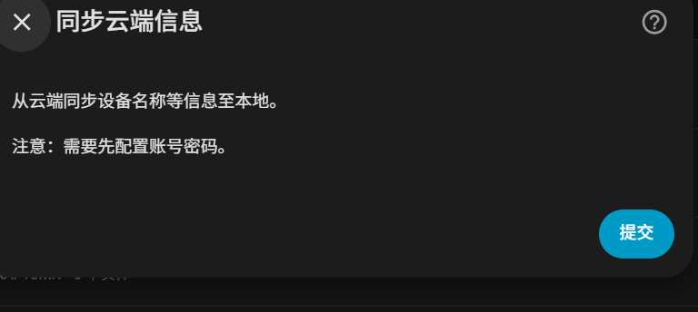
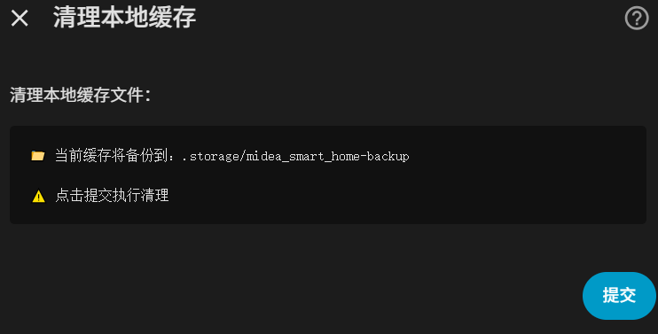

# Midea Smart Home 配置指南

English | [简体中文](GUIDE.md)

本指南将帮助您完成 Midea Smart Home 集成的配置。

## 目录

- [前置条件](#前置条件)
- [安装集成](#安装集成)
- [配置流程](#配置流程)
  - [步骤 1：输入账号密码](#步骤-1输入账号密码)
  - [步骤 2：选择设备](#步骤-2选择设备)
  - [步骤 3：设备认证](#步骤-3设备认证)
  - [步骤 4：配置完成](#步骤-4配置完成)
- [选项功能](#选项功能)
  - [更新账号密码](#更新账号密码)
  - [同步云端设备信息](#同步云端设备信息)
  - [清理本地缓存](#清理本地缓存)
- [常见问题](#常见问题)

---

## 前置条件

1. **美的美居账号**：需要已注册的美的美居账号（手机号）
2. **设备已绑定**：设备需要先在美的美居 App 中绑定
3. **网络环境**：Home Assistant 与设备在同一局域网内

## 安装集成

### HACS 安装（推荐）

1. 打开 HACS
2. 搜索 "Midea Smart Home"
3. 点击下载并重启 Home Assistant

### 手动安装

1. 将 `custom_components/midea_smart_home` 复制到 Home Assistant 的 `custom_components` 目录
2. 重启 Home Assistant

---

## 配置流程

### 步骤 1：输入账号密码

1. 进入 **设置** → **设备与服务** → **添加集成**
2. 搜索 "Midea Smart Home" 并选择
3. 输入您的美的美居账号和密码

#### 扫描地址说明

| 输入内容 | 说明 |
|---------|------|
| `auto` | 自动检测网络接口并扫描（默认推荐） |
| 路由器地址（如 `192.168.1.1`） | 扫描整个网段 |
| 设备 IP（如 `192.168.1.100`） | 只扫描指定设备 |

---

### 步骤 2：选择设备

系统会自动扫描局域网内的美的设备，扫描完成后显示设备选择界面。

#### 选项说明

| 选项 | 功能 |
|------|------|
| ✅ 前往添加设备 | 继续选择要添加的设备 |
| 🔄 重新扫描（尝试搜索更多设备） | 重新扫描网络，搜索更多设备 |

#### 重新扫描

如果第一次扫描没有找到所有设备，可以点击"重新扫描"：

**注意**：重新扫描不会重新登录云端，只会重新搜索局域网设备。

#### 选择要添加的设备

点击"前往添加设备"后，会显示设备列表，默认已勾选所有设备：

您可以取消勾选不需要添加的设备，然后点击提交。

---

### 步骤 3：设备认证

系统会自动获取每个设备的 Token 和 Key，用于本地通信认证。

**注意**：此过程需要连接云端 API，请确保网络畅通。

---

### 步骤 4：配置完成

认证成功后，集成配置完成，您将看到集成条目：

集成条目名称格式：`Midea | {账号} | {家庭名称}`

---

## 选项功能

点击集成条目右上角的"配置"按钮，可以访问以下选项：

### 更新账号密码

用于更新美的美居账号密码。如果密码已更改，请在此更新。

### 同步云端设备信息

从云端同步设备名称、型号等信息至本地。同步完成后会自动重新加载集成。

**使用场景**：
- 在美的美居 App 中修改了设备名称
- 需要更新设备型号信息

### 清理本地缓存

清理本地缓存的 Lua 脚本和 JSON 文件。当前缓存会备份到 `.storage/midea_smart_home-backup`。

**使用场景**：
- 设备协议更新后需要重新下载
- 遇到协议解析问题时
- 完全删除集成条目，重新配置的时候（推荐清理缓存）

---

## 常见问题

### Q: 扫描不到设备？

**解决方案**：
1. 确认设备已连接电源并开机
2. 确认设备已绑定到美的美居 App
3. 尝试输入路由器地址扫描整个网段
4. 检查 Home Assistant 和设备是否在同一局域网

### Q: 设备认证失败？

**解决方案**：
1. 检查账号密码是否正确
2. 确认设备已绑定到当前账号
3. 尝试在美的美居 App 中重新登录

### Q: 设备名称没有更新？

**解决方案**：
1. 进入集成选项
2. 点击"同步云端设备名称"
3. 等待同步完成，设备会自动重新加载

### Q: 支持哪些设备类型？

请查看 [支持的设备列表](README_hans.md#支持的设备)

---

## 技术支持

如遇问题，请访问 [GitHub Issues](https://github.com/Cyborg2017/midea_smart_home/issues) 反馈。
